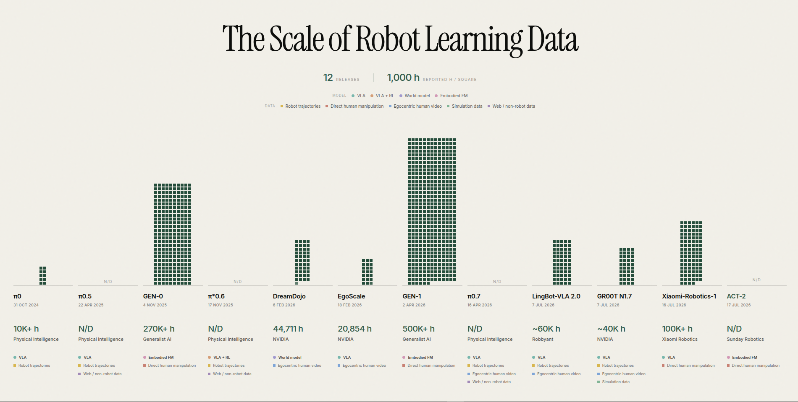

# The Scale of Robot Learning Data

**Live site: https://brikhmp18.github.io/the-scale-of-robot-learning-data/**

[](https://brikhmp18.github.io/the-scale-of-robot-learning-data/)

Interactive visualization of author-reported training-data scale across a curated, non-exhaustive selection of robot-learning releases. Each rendered square represents **1,000 reported hours**; a partial square is proportional.

## Research releases

| Release | Date | Reported hours | Model | Data | Collection | Institution |
|---------|------|----------------|-------|------|------------|-------------|
| [π0](https://arxiv.org/abs/2410.24164) | 31 Oct 2024 | 10,000+ h | VLA | Robot trajectories plus unquantified OXE data | Not uniformly disclosed | Physical Intelligence |
| [π0.5](https://arxiv.org/abs/2504.16054) | 22 Apr 2025 | N/D | VLA | Robot trajectories + web data | Language teleoperation for the mobile slice; mixed sources overall | Physical Intelligence |
| [GEN-0](https://generalistai.com/blog/gen-0) | 4 Nov 2025 | 270,000+ h | Embodied FM | Direct human manipulation | Proprietary handheld interface (UMI-like) | Generalist AI |
| [π*0.6](https://www.pi.website/blog/pistar06) | 17 Nov 2025 | N/D | VLA + RL | Robot trajectories + web data | Teleoperation, autonomous rollouts, and expert interventions | Physical Intelligence |
| [DreamDojo](https://arxiv.org/abs/2602.06949) | 6 Feb 2026 | 44,711 h | World model | Egocentric human video with latent-action proxy labels | Multiple video datasets | NVIDIA |
| [EgoScale](https://arxiv.org/abs/2602.16710) | 18 Feb 2026 | 20,854 h | VLA | Action-labeled egocentric human video | Multiple video datasets | NVIDIA |
| [GEN-1](https://generalistai.com/blog/gen-1) | 2 Apr 2026 | 500,000+ h | Embodied FM | Direct human manipulation | Proprietary handheld interface (UMI-like) | Generalist AI |
| [π0.7](https://arxiv.org/abs/2604.15483) | 16 Apr 2026 | N/D | VLA | Robot trajectories + egocentric human video + web data | Human demonstrations, autonomous rollouts, and interventions | Physical Intelligence |
| [LingBot-VLA 2.0](https://arxiv.org/abs/2607.06403) | 7 Jul 2026 | ~60,000 h | VLA | ~50,000 h robot trajectories + ~10,000 h egocentric human video | Not uniformly disclosed | Robbyant |
| [GR00T N1.7](https://developer.nvidia.com/blog/develop-humanoid-robot-policies-end-to-end-with-nvidia-isaac-gr00t/) | 7 Jul 2026 | ~40,000 h | VLA | Robot trajectories + egocentric human video + simulation | Real demonstrations, human video, and simulated rollouts | NVIDIA |
| [Xiaomi-Robotics-1](https://robotics.xiaomi.com/xiaomi-robotics-1.html) | 16 Jul 2026 | 100,000+ h | VLA | Direct human manipulation | UMI | Xiaomi Robotics |
| [ACT-2](https://www.sunday.ai/blog/act-2-preview) | 17 Jul 2026 | N/D | Embodied FM | Direct human manipulation | Skill Capture Glove (UMI lineage) | Sunday Robotics |

## Methodology and caveats

- Figures are claims made by the authors or institutions in the linked primary sources; they are not independently audited measurements.
- The chart uses pretraining totals or stated training-mixture totals. “+” denotes a reported lower bound, “~” an approximate figure, and N/D a total the source does not disclose.
- Hours are not directly interchangeable. `Data` describes what executes or records the action; `Collection` describes how it was acquired. Robot trajectories are executed by a robot and may come from teleoperation, human intervention, or autonomous execution. Direct human manipulation is captured while a person acts on the environment without a robot, including UMI and related interfaces.
- Category labels indicate that a modality is present; they do not imply an equal split. For GR00T N1.7, NVIDIA does not publish a finer split within the ~32,000 real-demonstration and human-egocentric hours.
- π0.5 is N/D because the paper quantifies only its ~400-hour mobile-manipulator slice. It says the rest is an extended π0 dataset plus other robot, OXE, and web data, but does not publish a total; adding the π0 and mobile figures would not establish a valid lower bound.
- π*0.6 is N/D because its paper describes “tens of thousands of hours” of demonstrations but does not provide an exact pretraining total or a total duration for its additional autonomous episodes and interventions. `VLA + RL` records both its architecture and its RECAP reinforcement-learning recipe; RL alone is not a model architecture.
- π0.7 is N/D because the paper publishes its data modalities but not the total duration. Although it trains on autonomous and failed episodes and matches specialized RL-finetuned policies in some evaluations, π0.7 itself is trained with contextual conditioning rather than RL.
- ACT-2 is N/D because Sunday Robotics publishes relative pretraining scales but no absolute hours or trajectory count. Its single-demonstration result is a post-training experiment, not the size of its pretraining corpus.

The claim-by-claim evidence log is in [FACT_CHECK.md](./FACT_CHECK.md).

GR00T N1.7 combines approximately 32,000 hours of real demonstrations and human egocentric data with approximately 8,000 hours of simulated rollouts and demonstrations.

GEN-1 is pretrained without robot data on more than half a million hours of physical-interaction data collected from humans with proprietary portable devices. Generalist describes these as lightweight handheld ergonomic devices; they are UMI-like in collection strategy, but the company does not call them UMI. Its reported task-adaptation results use approximately one hour of robot data for each result shown.

Xiaomi-Robotics-1 uses more than 100,000 hours of embodiment-free UMI manipulation trajectories across more than 1,700 scenarios for pretraining. Its post-training mixture contains about 10,000 hours, including more than 7,200 hours of in-house robot data, more than 1,000 hours of instruction-labeled UMI data, and filtered public robot data. The chart represents only the pretraining corpus.

## Why robot data is difficult to scale

Real-robot demonstration collection commonly requires physical hardware and teleoperation; the [DreamDojo paper](https://arxiv.org/abs/2602.06949) explicitly identifies the cost of collecting each new robot trajectory. Dataset scale therefore depends not only on duration, but also on embodiment coverage, task diversity, labels, filtering, and modality.

The releases shown here respond with cross-embodiment data, direct-human-manipulation interfaces—including UMI and related proprietary systems—latent-action video learning, simulation, and automated filtering or labeling.

## Run locally

```bash
npm install
npm run dev
```

To verify or preview a production build:

```bash
npm run build
npm run preview
```

## Deploy (GitHub Pages)

- Source: `main` branch (configured in `Settings > Pages`).
- Every push to `main` triggers a new GitHub Pages build.
- Public URL: https://brikhmp18.github.io/the-scale-of-robot-learning-data/

## Stack

React 19 · TypeScript · Vite 6 · Tailwind CSS v4 · SVG
